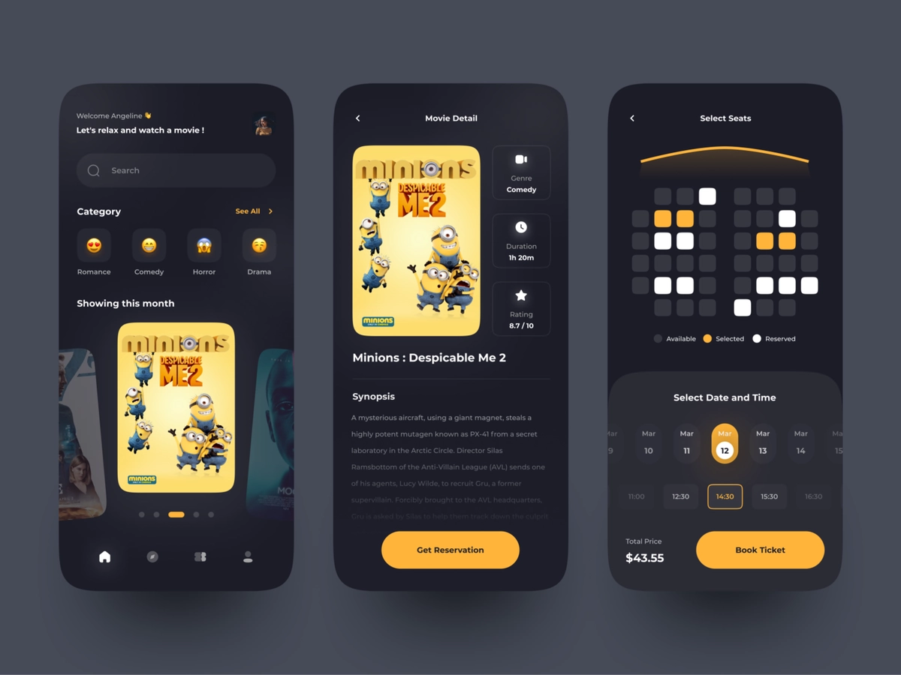
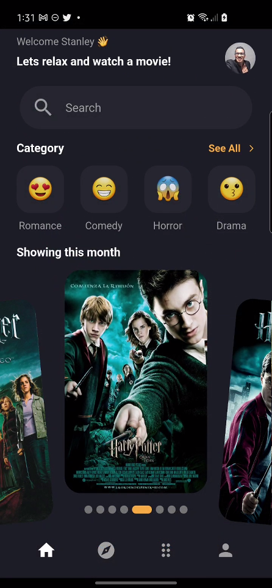
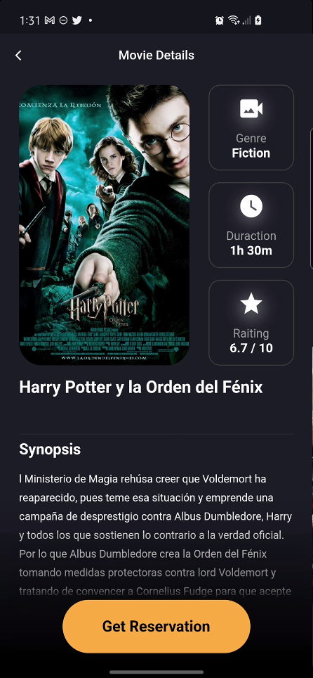
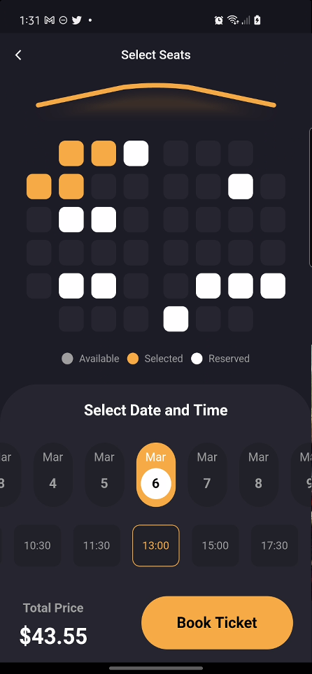

## FLUTTER MOVIE APP
___
## Inspiración

- #### [Enlace al diseño en Dribbble](https://dribbble.com/shots/16222673-Pilm-Cinema-Booking-App)

### Diseñador: Regi Pangestu
- Dribbble: https://dribbble.com/regipangestu_
- Correo: regipangestu91@gmail.com

___
## Aplicación Flutter
### Descripción

Aplicación para compra de boletos de cine, busqueda de pelicula, ver los detalles de la pelicula y proceder a seleccionar los asientos y el horario de la pelicula.

Alguno detalles de la aplicación:
- Uso de Animaciones
- Uso de Custom painter
- Sin packages

## Capturas de pantalla
<TABLE BORDER>
    <TR>
        <TH style="text-align:center">Busqueda peliculas</TH>
        <TH style="text-align:center">Detalle pelicula</TH>
        <TH style="text-align:center">Comprar boletos</TH>
    </TR>
	<TR>
		<TD></TD> 
        <TD></TD> 
        <TD></TD>
	</TR>
</TABLE>

## Demo en dispositivo fisico

